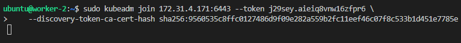

# How to install Kubernetes on Ubuntu with Flannel Plugin

## Create master and worker nodes using attached CloudFormation template


## Change the worker nodes' name properly


## SSH into all three nodes.


## change the worker nodes' name using the following commands
```bash
sudo hostnamectl set-hostname worker-#
newgrp
```


## Initialize Kubernetes control-plane using the following command on the master node with sudo 
Use `--ignore-preflight-errors=NumCPU` flag if your instances do not meet the CPU requirement if your instance type is t2.micro. You do not need to use this flag with t2.medium type (t2.micro and t2.medium are only instances which are allowed in the CloudFormation template).
```bash
sudo kubeadm init --apiserver-advertise-address=$(curl 169.254.169.254/latest/meta-data/local-ipv4) --pod-network-cidr=10.244.0.0/16 --ignore-preflight-errors=NumCPU
```


## Join all the worker nodes using the `kubeadm join` command appeared after initializing our Kubertenes control-plane



## Run the following commands on your master to start using the cluster
```bash
mkdir -p $HOME/.kube
sudo cp -i /etc/kubernetes/admin.conf $HOME/.kube/config
sudo chown $(id -u):$(id -g) $HOME/.kube/config
```

## In order for your iptables to see bridged traffic, set `net.bridge.bridge-nf-call-ip6tables` to 1 on all nodes
```bash
cat << EOF | sudo tee /etc/sysctl.d/k8s.conf
net.bridge.bridge-nf-call-ip6tables = 1
net.bridge.bridge-nf-call-iptables = 1
EOF
sudo sysctl --system
```

## Final step: Install Flannel network plugin into the master node!
```bash
kubectl apply -f https://raw.githubusercontent.com/coreos/flannel/master/Documentation/kube-flannel.yml
```


## Check your cluster with `kubectl get nodes` and `kubectl get pods -n kube-system` commands to see it is READY!

